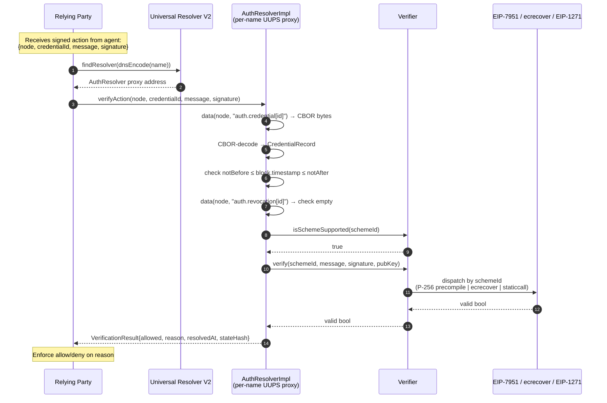

# Prototype Spec: Verifier + AuthResolverImpl

**Version:** v1.0-draft.02 · 2026-05-18

**Purpose:** Normative specification of the Authority tier for AI-agent identity on ENS. Defines two contracts: a **Verifier** (signature-verification dispatch with three v1 schemes — WebAuthn-ES256, ECDSA-secp256k1, EIP-1271) and an **AuthResolverImpl** (per-name UUPS proxy on top of ENSv2's PermissionedResolver) that together let any ENS name serve as an authentication anchor for an agent's signed actions.

**Status:** NORMATIVE for §3 (Verifier), §4 (AuthResolverImpl), §5 (`verifyAction` orchestration), with inline conformance criteria tables at §3.6, §4.8, §5.4. Other sections are non-normative context, deferred surface, or references. Items still open (full signed-freshness wire format, CBOR field-level layouts, expanded threat model, concrete reference-implementation pointer) carry forward to later v1.0-draft revisions and v1.0-final per §9.

**Pillar role:** Implements the Authority tier of the MAIP architecture (one of three architectural tiers: Display, Discovery, Authority).

**Target chain:** Ethereum mainnet via ENSv2 contracts; testnet deployment first (Sepolia, contingent on canonical VerifiableFactory address publication).

**Reference deployment (illustrative, not normative):** `emilemarcelagustin.eth` on Pinata Agents; ERC-8004 #24994 on Base mainnet.

---

## 1. Scope and Non-Goals

### 1.1 In scope (NORMATIVE in this revision)

| Surface | Section | Normative content |
|---|---|---|
| **Verifier** contract | §3 | Three registered schemes; dispatch surface; `IVerifier` interface; statelessness invariants |
| **AuthResolverImpl** contract | §4 | Inheritance, deployment model, EIP-165 advertisement, record profile, HCA attribution, upgrade authority |
| **`verifyAction` orchestration** | §5 | Required ordering, return-type semantics, `DenyReason` enum, name-lifecycle caveats |

### 1.2 Normative conventions

This document uses **RFC 2119** keywords: **MUST**, **MUST NOT**, **SHOULD**, **SHOULD NOT**, **MAY**. Lowercase uses of these words carry no normative weight.

A conformant Verifier or AuthResolverImpl is one that satisfies every **MUST** and **MUST NOT** in §3, §4, and §5, plus the SHOULD/MAY rows in the conformance tables at §3.6, §4.8, and §5.4 to the extent claimed by the implementation.

### 1.3 Terminology

These terms have specific meanings in this spec. Defined here so the normative body (§3–§5) and conformance tables (§3.6, §4.8, §5.4) can use them without re-introducing them.

| Term | Definition |
|---|---|
| **MARP** | Managed Agent Runtime Platform — an operator that runs AI agents on behalf of end users (e.g., Bankr Agents, Pinata Agents, ZeroDev/Kernel-based platforms). The Authority-tier surface this spec defines is what MARPs publish under an ENS name so counterparties can verify their agents' signed actions. |
| **AuthResolver** | The runtime entity (`AuthResolverImpl` per-name UUPS proxy) that holds an ENS name's credential, capability, and revocation records and exposes the `verifyAction` orchestration call. When unqualified, "AuthResolver" refers to a deployed proxy instance; `AuthResolverImpl` refers to the shared implementation contract behind those proxies. |
| **AuthResolverImpl** | The single shared implementation contract deployed once per chain. Per-name AuthResolver proxies are UUPS proxies pointing at this implementation, deployed via `VerifiableFactory.deployProxy` (§4.3). |
| **Verifier** | The single shared signature-verification dispatch contract (§3). Stateless, permissionless, dispatches by `schemeId` to one of three v1 handlers (P-256/WebAuthn, secp256k1/ECDSA, EIP-1271). |
| **Credential** | A registered public key + signature scheme + validity window published under an ENS name as `auth.credential[<id>]`. The thing the Verifier verifies signatures against. |
| **Capability** | A scope declaration published as `auth.capability[<id>]`. Reserved in v1 (publishable but not consumed by `verifyAction`); active enforcement deferred to v1.1. |
| **Revocation** | An explicit revocation flag published as `auth.revocation[<id>]`. Presence (non-empty bytes) = revoked, regardless of decoded content. Absence = not revoked. |
| **Name owner** | The address that holds `ROLE_UPGRADE` on a per-name AuthResolver proxy. Typically the address controlling the ENS name itself, though the two can diverge (per §4.3 deployer caveat — proxy address is keyed to the deployer at `deployProxy` time, not the name owner per se). |
| **Operator EOA** | A delegated writer to which the name owner grants `ROLE_SET_DATA` (with optional `ROLE_SET_DATA_ADMIN` per §4.5.2) for a specific credential key. The operator can publish or revoke that credential without holding broader name authority. |
| **Controlling EOA** | The end-user wallet that owns a smart-account proxy registered with an HCAFactory. Under HCA attribution (§4.6), `HCAContextUpgradeable._msgSender` returns this EOA, not the smart-account proxy address. The address that should hold EAC roles for smart-account-backed deployments. |
| **HCA proxy** | A smart-account proxy registered with an HCAFactory. When such a proxy calls AuthResolver, the HCA layer rewrites `_msgSender` to the controlling EOA so EAC role checks resolve correctly. |
| **HCAFactory** | A registry contract implementing `IHCAFactoryBasic.getAccountOwner(address)` that maps HCA proxies to their controlling EOAs. The production deployment is operated by Rhinestone; the AuthResolverImpl constructor accepts any `IHCAFactoryBasic` implementation (or `address(0)` to disable HCA entirely). |
| **Relying party** | A counterparty receiving a signed action from an agent who wants to verify the signature is currently valid under the agent's published credentials. Calls `verifyAction` (or `data` + `Verifier.verify` directly) after resolving the AuthResolver proxy address via Universal Resolver V2. |
| **Reference deployment** | A live ENS name + AuthResolver setup cited in this spec for illustrative purposes (e.g., `emilemarcelagustin.eth`, `alpha-go.bankrtest.eth`). Not normative; implementers MUST NOT hard-code reference-deployment addresses. |
| **Frozen snapshot** | A spec revision file that has been promoted to v1.0-draft.0N and MUST NOT be edited in place. Corrections ship as v1.0-draft.0(N+1). |

### 1.4 Parties

The Authority-tier surface involves these actors. Each row says what the actor controls and how the spec constrains them.

| Party | What they control | Where they appear |
|---|---|---|
| **Name Owner** | The ENS name, the per-name AuthResolver proxy upgrade authority (`ROLE_UPGRADE` on `ROOT_RESOURCE`), and which operators get delegated write access | §4.3 (deployment), §4.5.1 (grants), §4.7 (upgrade) |
| **Operator** | Permission to publish or rotate one or more `auth.credential[<id>]` / `auth.capability[<id>]` / `auth.revocation[<id>]` records under one ENS name, scoped via EAC role grants | §4.5.1, §4.5.2 (admin layer governs whether they can re-delegate) |
| **MARP Platform** | The agent runtime that signs actions on behalf of end users. May ALSO be the Name Owner or Operator (when the platform itself owns the ENS name) or may be neither (when end users own their ENS names and grant the platform Operator scope) | §4.6 (HCA attribution for smart-account-backed MARPs), §5 (signed-action flow) |
| **Smart-Account User** | An end user controlling a smart-account proxy (Safe, ERC-4337, ZeroDev/Kernel) registered with an HCAFactory. Their controlling EOA appears as `_msgSender` for EAC checks via HCA rewriting | §4.6 |
| **Relying Party** | A counterparty (another contract, a backend, a wallet) that verifies signed actions from an agent before honoring them. Bears the §5.3 normative rules (UR-routed discovery, no address caching, ENSIP-15 normalization in tooling) | §5, §5.3, §5.4 |
| **HCAFactory** | A contract that authoritatively maps HCA proxies to controlling EOAs. The AuthResolverImpl makes a single `getAccountOwner` call per request via the HCA layer; HCAFactory correctness is out of scope for this spec | §4.6 |
| **Implementation Author** | The party deploying `AuthResolverImpl` (the shared implementation) on each chain. Distinct from the per-name proxy deployer. Should be the project / DAO maintaining the audited implementation registry (deferred per §4.7) | §4.3, §4.7 |
| **Verifier Maintainer** | The party deploying and operating the singleton Verifier contract (per chain). Scheme set is immutable post-deployment (§3.4); maintenance is limited to chain-level operational concerns (e.g., re-deployment after a major EIP-7951 precompile change) | §3, §3.1, §3.4 |

The spec does NOT mandate a specific governance structure for the Implementation Author or Verifier Maintainer roles. Each MARP-owned proxy is independently upgradeable by its Name Owner (§4.7); the shared implementation contract has no central upgrade authority.

---

## 2. Composite of Standards

The Verifier and AuthResolverImpl compose existing standards rather than introducing new core protocol changes. The AuthResolverImpl is a **verification orchestration layer** on top of v2 primitives, not a source of new Authority-tier primitives.

| Standard | Composition role |
|---|---|
| **ENSIP-25** | Verifiable agent identity binding (ENS name ↔ ERC-8004 record). **Identity-layer precondition** for AuthResolverImpl use; not enforced inside `verifyAction` (see §5.3). |
| **ENSIP-26** | Agent-context records (attribution: services, endpoints, description). **Attribution-layer composition** alongside AuthResolverImpl — coexists on the same name under a separate namespace (`services[*]` text records vs. `auth.*` data records). Read by relying parties for context alongside `verifyAction`; not enforced inside `verifyAction` (see §5.3). |
| **ENSIP-64** | Typed text records. Used only for human-readable metadata under sibling namespaces (e.g., `auth.credential.label[<id>]`); not for credential bytes (those live in `data` records per §4.5). |
| **EIP-165 / ENSIP-22 (`IERC7996`)** | Resolver capability discovery via `supportsFeature(bytes4 featureId)` (parallel to EIP-165's `supportsInterface(bytes4)`). AuthResolverImpl advertises a custom feature id (§4.4). Inherited from PermissionedResolver. |
| **EIP-1967** | Standard implementation slot for UUPS proxies (`UUPSProxyLogic.sol:9` — `_IMPLEMENTATION_SLOT = 0x360894...2bbc`). The verifiable salt itself is **not** in a storage slot — it is appended as the **last 32 bytes of the clone proxy's runtime bytecode** (`CloneProxyBytecode.sol:14,28-30`) and read on demand via `extcodecopy` (`UUPSProxyLogic.sol:73-79`). |
| **EIP-3668** | CCIP-Read protocol. Reserved for the deferred `getFreshSignedState` path; the basic `data` read path does NOT revert with `OffchainLookup`. |
| **EIP-7951** | P-256 precompile. Verifier dispatch handler for the `WebAuthn-ES256` scheme (§3.2). |
| **ERC-8004** | Agent identity registry. Referenced by ENSIP-25 binding; AuthResolverImpl does not call the registry directly. |
| **ENSv2 PermissionedResolver** | Parent contract of AuthResolverImpl. Source: `PermissionedResolver.sol` in `ensdomains/contracts-v2`. 17-base inheritance chain (full list in §4.2): substrate (HCA, UUPS, EAC) + capability advertisement (`IERC7996`) + batched reads (`IMulticallable`) + 11 record-profile interfaces (`IDataResolver`, `ITextResolver`, `IAddrResolver`, etc.) + `IProxyAuthorization` (verifiable-factory hook) + `IPermissionedResolver` (self-interface). |
| **ENSv2 `EnhancedAccessControl`** | Per-(node, recordKey) write delegation inherited from PermissionedResolver. AuthResolverImpl uses this for credential / capability writes (§4.5). |
| **ENSv2 `HCAContextUpgradeable`** | Smart-account attribution inherited from PermissionedResolver. AuthResolverImpl uses this for HCA-aware role grants (§4.6). |
| **ENSv2 `VerifiableFactory`** | CREATE2 proxy factory. AuthResolverImpl proxies are deployed via `deployProxy(impl, salt, data)`. |

**Three-layer framing.** ENSIP-25, ENSIP-26, and the AuthResolver `auth.*` records form a three-layer agent-identity story:

1. **Identity layer (ENSIP-25)** — "Is this ENS name bound to this agent's ERC-8004 record?"
2. **Attribution layer (ENSIP-26)** — "What is this agent? What services does it offer? Where do I reach it?"
3. **Authentication layer (AuthResolver)** — "Is this signed action verifiable under the agent's published credentials?"

A relying party doing a serious verification reads all three. AuthResolverImpl itself implements only layer 3 — `verifyAction` does NOT enforce layers 1 or 2. The composition is the relying party's responsibility, addressed at §5.3.

**ENSIP-10 (wildcard resolution)** appears in the v0.1 composite but is **deliberately omitted** here — single-name model assumed for v1, deferred per §9 if a Wave-1 MARP needs per-agent subnames.

---

## 3. Verifier

### 3.1 Purpose and invariants

The Verifier is a single shared contract responsible for **signature verification and scheme dispatch only**. It has no records, no roles, no policy state, and no per-name configuration.

A conformant Verifier:

- **MUST** be permissionlessly callable. Any contract or EOA can invoke `verify(...)` without prior registration.
- **MUST NOT** hold per-call state. `verify` is `view`; no replay protection lives at this layer.
- **MUST NOT** revert on an unsupported `schemeId`. It MUST return `valid = false` instead, so the caller (typically the AuthResolverImpl's `verifyAction`) can map the outcome to a structured `DenyReason` (per §5.1).
- **MUST** be deployed once per chain. The AuthResolverImpl's deployment salt embeds a `versionId` (§4.3); the Verifier's address is captured by that versioning.

### 3.2 Registered signature schemes (v1)

v1 ships exactly **three** registered schemes, chosen to cover the EOA, smart-contract-account, and passkey signing models present across named Wave-1 MARP candidates from day zero:

| schemeId | Scheme | Verification primitive | Covers |
|---|---|---|---|
| `keccak256("WebAuthn-ES256")` | ECDSA over P-256 with SHA-256 challenge hashing | EIP-7951 P-256 precompile | Passkey-backed signing (WebAuthn authenticators) |
| `keccak256("ECDSA-secp256k1")` | ECDSA over secp256k1 with keccak256 challenge hashing | `ecrecover` | EOA signing, including standard agent-runtime signing endpoints (e.g., Bankr Agents' `/agent/sign`) |
| `keccak256("EIP-1271")` | Contract-account signature | staticcall to `pubKey`-encoded contract's `isValidSignature(bytes32, bytes)` returning the EIP-1271 magic value | Smart-contract-account signing (EIP-7702-delegated wallets, ZeroDev/Kernel, generic ERC-4337 accounts) |

A conformant Verifier:

- **MUST** register all three schemes at deployment. Returning `false` from `isSchemeSupported` for any of the three is a conformance violation.
- **MUST** dispatch by `schemeId`. The mapping above is the source of truth for v1.
- For `WebAuthn-ES256`, the `message` parameter **MUST** be passed to the EIP-7951 precompile as the pre-hashed challenge per the WebAuthn assertion verification procedure. The Verifier MUST NOT re-hash the message before precompile invocation.
- For `ECDSA-secp256k1`, the `pubKey` parameter **MUST** be 64 bytes (uncompressed, no `0x04` prefix); the Verifier MUST recover the address via `ecrecover` and compare against `keccak256(pubKey)[12:]`. EIP-712 typed-data hashing is the caller's responsibility — the Verifier sees the final 32-byte digest in `message`.
- For `EIP-1271`, the `pubKey` parameter **MUST** be a 20-byte contract address (left-padded to `bytes` if the caller passes a longer encoding; the Verifier MUST take the rightmost 20 bytes). The Verifier MUST staticcall `isValidSignature(bytes32 hash, bytes signature)` and return `true` if and only if the returned 4 bytes equal `0x1626ba7e`.

### 3.3 `IVerifier` interface (NORMATIVE)

```solidity
interface IVerifier {
 /// @notice Verify a signature using a registered signature scheme.
 /// @param schemeId keccak256 identifier (see §3.2).
 /// @param message Scheme-specific message bytes. For WebAuthn-ES256 this is the
 /// pre-hashed challenge; for ECDSA-secp256k1 this is a 32-byte digest;
 /// for EIP-1271 this is a 32-byte hash passed to the contract.
 /// @param signature Scheme-specific signature blob.
 /// @param pubKey Scheme-specific public key (uncompressed P-256 point for WebAuthn-ES256;
 /// 64-byte uncompressed secp256k1 key; 20-byte address for EIP-1271).
 /// @return valid True iff the signature verifies under the scheme.
 function verify(bytes32 schemeId,
 bytes calldata message,
 bytes calldata signature,
 bytes calldata pubKey) external view returns (bool valid);

 /// @notice Whether the Verifier dispatches the given scheme.
 function isSchemeSupported(bytes32 schemeId) external view returns (bool);
}
```

### 3.4 Dispatch surface and extensibility

The `schemeId` parameter is the extensibility surface. Future cycles **MAY** register additional schemes (BLS12-381 aggregation, post-quantum candidates) by deploying a successor Verifier and bumping the `versionId` embedded in the AuthResolverImpl deployment salt (§4.3). Adding a scheme is a **new Verifier deployment**, not an upgrade of the v1 Verifier — v1 is immutable at the dispatch layer.

A conformant Verifier **MUST NOT** expose a setter that adds, removes, or modifies scheme handlers post-deployment. Scheme registration is fixed at construction.

### 3.5 Security considerations

- **No batch entry point.** v1 does not expose a batched `verifyMany`. Relying parties needing to verify N signatures call `verify` N times. Deferred to v1.1 if pilot integrations request it.
- **No replay protection.** Replay binding is the caller's responsibility (typically via `stateHash` in `VerificationResult` per §5.1, or via EIP-712 typed-data nonces in the application-layer message).
- **Scheme handler trust.** The EIP-1271 path executes a staticcall to a contract address the caller controls (via `pubKey`). The Verifier MUST treat the call as untrusted (gas-bounded, revert-safe). Implementations SHOULD cap the staticcall gas to a documented limit (e.g., 100,000 gas) and treat any revert as `valid = false`.
- **Precompile availability.** The EIP-7951 precompile MUST be live on the target chain at the AuthResolverImpl deployment block. Per ENS documentation (search "EIP-7951"), the precompile is available on Ethereum mainnet **after the Fusaka hardfork**. Per-L2 availability is not uniformly enumerated; deployment targets MUST confirm precompile presence on each chain before the AuthResolverImpl proxy is deployed there.

### 3.6 Conformance criteria (NORMATIVE)

A conformant Verifier satisfies every MUST/MUST NOT and SHOULD/MAY in this table. This restates the normative content in §3.1–§3.5; the source sections remain authoritative for any discrepancy.

| # | Requirement | Type | Source |
|---|---|---|---|
| V1 | Permissionlessly callable; no per-call state | MUST | §3.1 |
| V2 | `verify` is `view`; no replay protection at this layer | MUST | §3.1, §3.5 |
| V3 | Return `false` (not revert) for unsupported `schemeId` | MUST | §3.1 |
| V4 | Deployed once per chain | MUST | §3.1 |
| V5 | Register all three v1 schemes (`WebAuthn-ES256`, `ECDSA-secp256k1`, `EIP-1271`) at construction | MUST | §3.2 |
| V6 | Dispatch by `schemeId` per the §3.2 table | MUST | §3.2 |
| V7 | For `WebAuthn-ES256`: pass `message` as the pre-hashed challenge to the EIP-7951 precompile | MUST | §3.2 |
| V8 | For `WebAuthn-ES256`: NOT re-hash the message before precompile invocation | MUST NOT | §3.2 |
| V9 | For `ECDSA-secp256k1`: `pubKey` is 64 bytes uncompressed (no `0x04` prefix); recover via `ecrecover` and compare against `keccak256(pubKey)[12:]` | MUST | §3.2 |
| V10 | For `EIP-1271`: take rightmost 20 bytes of `pubKey` as the contract address | MUST | §3.2 |
| V11 | For `EIP-1271`: staticcall `isValidSignature(bytes32, bytes)`; return `true` iff returned 4 bytes equal `0x1626ba7e` | MUST | §3.2 |
| V12 | NOT expose any setter that adds, removes, or modifies scheme handlers post-deployment | MUST NOT | §3.4 |
| V13 | EIP-7951 precompile MUST be live on target chain at deployment block (per Fusaka hardfork status for mainnet; per-L2 confirmation required) | MUST | §3.5 |
| V14 | Treat EIP-1271 staticcall as untrusted (gas-bounded, revert-safe) | MUST | §3.5 |
| V15 | Cap EIP-1271 staticcall gas to a documented limit (e.g., 100K) and treat any revert as `valid = false` | SHOULD | §3.5 |
| V16 | Expose a batched `verifyMany` entry point | MAY (deferred to v1.1) | §3.5 |

---

## 4. AuthResolverImpl

### 4.1 Purpose

AuthResolverImpl is the **verification orchestration layer** that composes ENSv2 storage and permission primitives into an Authority-tier surface for MARPs. It holds **credential**, **capability**, and **revocation** records under any ENS name and exposes `verifyAction` (§5) as the convenience entry point that bundles credential lookup + scheme dispatch + revocation check.

AuthResolverImpl does **NOT** introduce new primitives for write delegation, scoped binary storage, or ownership-change cleanup. v2's PermissionedResolver substrate ships those natively. AuthResolverImpl's contribution is the orchestration surface plus the credential / capability / revocation record schemas.

### 4.2 Inheritance (NORMATIVE)

A conformant AuthResolverImpl **MUST** extend `PermissionedResolver` directly. The exact `is` clause at `PermissionedResolver.sol:94-113` declares 17 bases, grouped here by role:

```
AuthResolverImpl (per-name UUPS proxy instance — see §4.3)
 └── PermissionedResolver
 ├── IPermissionedResolver (self-interface — defines errors/events)
 ├── HCAContextUpgradeable (smart-account attribution — see §4.6)
 ├── UUPSUpgradeable (per-instance ROLE_UPGRADE — see §4.7)
 ├── EnhancedAccessControl (resource-keyed bitmap roles — see §4.5)
 ├── IERC7996 (EIP-165 / supportsFeature — see §4.4)
 ├── IMulticallable (batched reads for relying-party UX)
 ├── IProxyAuthorization (VerifiableFactory upgrade hook — see §4.7)
 └── 11 record-profile interfaces:
 IABIResolver, IAddrResolver, IAddressResolver, IContentHashResolver,
 IDataResolver, IHasAddressResolver, IInterfaceResolver, INameResolver,
 IPubkeyResolver, ITextResolver, IVersionableResolver
```

The AuthResolverImpl **MUST NOT** re-implement primitives already present on PermissionedResolver. It **MUST** add only:

1. The custom auth profile methods (§5).
2. The EIP-165 feature id advertisement (§4.4).
3. The optional `getDeployedFor` view (§4.3).

PermissionedResolver itself is **not declared `abstract`** — its setters (`setData`, `setAlias`, `setText`, etc.) are `external` and non-virtual (`PermissionedResolver.sol:94`). A subclass like AuthResolverImpl can ADD methods but **cannot override** inherited setter signatures or modifiers without contract-level changes upstream. The spec's "extend" framing holds for additions only.

Resolver-level aliasing (`setAlias`, gated by `ROLE_SET_ALIAS = 1 << 28` root-only — `PermissionedResolverLib.sol:42`) is inherited from PermissionedResolver. AuthResolverImpl **MUST NOT** override or disable it. Full alias semantics for multi-name MARPs are deferred to v1.1.

### 4.3 Deployment model (NORMATIVE)

AuthResolverImpl is **not** a single shared contract. Per `VerifiableFactory.sol`, the v2 pattern is one implementation contract + N per-name UUPS proxies.

A conformant deployment:

- **MUST** deploy `AuthResolverImpl` once per chain as the shared implementation.
- **MUST** deploy each per-name AuthResolver as a UUPS proxy via the canonical factory:
 ```solidity
 function deployProxy(address implementation, uint256 salt, bytes memory data)
 external returns (address proxy);
 ```
 (Source: `VerifiableFactory.sol:32` + `IVerifiableFactory.sol:7`.)
- **MUST** pass the application-level salt as a `uint256` value derived from `keccak256(abi.encode("AuthResolverV1", ownerAddress, versionId))`, cast to `uint256`, where `ownerAddress` is the name owner that will hold `ROLE_UPGRADE` on the proxy and `versionId` is a `uint256` bumped per Verifier-major release.
- **SHOULD** expose `getDeployedFor external view returns (address owner, uint256 versionId, address verifier)` returning the immutable values baked into the proxy's init data. This is the only way a relying party can verify resolver-to-owner binding without an external registry lookup.

**`verifyContract` provenance check (NORMATIVE for relying parties that want to verify proxy provenance).** The canonical signature is **two arguments**:

```solidity
function verifyContract(address proxy, address expectedImplementation)
 external view returns (bool);
```

(Source: `VerifiableFactory.sol:58` + `IVerifiableFactory.sol:9`.) The factory internally calls `IUUPSProxy(proxy).getVerifiableProxyData` to read the salt (appended to the clone's runtime bytecode per §2), reconstructs the expected CREATE2 address from `(UUPSProxy creation code, factory, outerSalt)`, and **only returns true if both** the address matches AND the proxy currently points at `expectedImplementation`.

**Deployer caveat (load-bearing for address prediction).** The outer CREATE2 salt is computed as:

```solidity
bytes32 outerSalt = keccak256(abi.encode(msg.sender, salt));
```

(Source: `VerifiableFactory.sol:33`.) The outer salt mixes in the **deployer's address** (`msg.sender` at `deployProxy` time), not the name owner's address. As a result, **the proxy address depends on who actually broadcasts the deployment transaction.** If a name owner deploys their own AuthResolver, the proxy address is keyed to their EOA; if a third party (a deployment script, a UI's deployer, a relayer) deploys on their behalf, the address is keyed to that third party. Implementers that need deterministic per-owner addresses MUST either (a) require the name owner to deploy directly, (b) use a known canonical deployer address across all deployments, or (c) record the deployer in the proxy's init data and expose it via `getDeployedFor` so relying parties can re-derive the address.

**Deployment event for indexers.** The factory emits:

```solidity
event ProxyDeployed(address indexed sender,
 address indexed proxyAddress,
 uint256 salt,
 address implementation);
```

(Source: `IVerifiableFactory.sol:5`. Note: `salt` and `implementation` are NOT indexed.) Indexers tracking AuthResolver deployments SHOULD subscribe to this event filtered by `implementation == <AuthResolverImpl address>` to discover all per-name proxies on a chain.

The implementation **MUST NOT** assume the existence of a centralized registry of MARP-deployed proxies. Each Wave-1 MARP deploys their own proxy; relying parties discover the proxy address via Universal Resolver V2's `findResolver(name)` (`UniversalResolverV2.sol`), not via an AuthResolver-specific directory.

### 4.4 EIP-165 / `IERC7996` advertisement (NORMATIVE)

A conformant AuthResolverImpl:

- **MUST** advertise a feature id (4-byte selector) derived from `keccak256("auth-resolver-v1")` via `IERC7996.supportsFeature(bytes4 featureId)` (signature per ENSIP-22 / ERC-7996, ENS documentation at "ERC-7996"; the v2 PermissionedResolver inherits `IERC7996`). This is the single one-call detection signal v2-aware clients use to confirm AuthResolver capability.
- **MUST** advertise the custom auth profile selectors (`verifyAction`, `getFreshSignedState` once spec'd in a subsequent revision) via the inherited `supportsInterface(bytes4)` override. The selectors are the only signal Universal Resolver V2 uses to know whether to route a profile call.
- **MAY** advertise additional per-category feature ids in future revisions (e.g., `auth-resolver-credential-v1`) if v1.1 adds independent versioning per record category. Not required in v1.

Universal Resolver V2's typed error vocabulary — `ResolverNotFound`, `ResolverNotContract`, `UnsupportedResolverProfile(bytes4 selector)`, `ResolverError`, `ReverseAddressMismatch`, `HttpError` — flows through to AuthResolver callers unchanged. The error definitions live in upstream `AbstractUniversalResolver` (the local `UniversalResolverV2.sol` inherits from it; the upstream is at `lib/ens-contracts/`). `UnsupportedResolverProfile(bytes4)` (selector `0x7b1c461b`) is also declared by `IPermissionedResolver.sol:32` and raised by PermissionedResolver's own `resolve` path (`PermissionedResolver.sol:535,547`) when an inner staticcall returns empty data. Clients distinguishing `UnsupportedResolverProfile(selector)` (resolver doesn't implement that record type) from `ResolverError` (resolver reverted) feed into the `DenyReason` mapping in §5.1.

### 4.5 Record profile and EAC role grants (NORMATIVE)

A conformant AuthResolverImpl:

- **MUST** store credential, capability, and revocation records under the inherited `IDataResolver.data(node, key) → bytes` profile (`PermissionedResolver.sol` Supported Record Types). It **MUST NOT** store these records as `text` records. Text records are reserved for human-readable metadata (e.g., `auth.credential.label[<id>]` = "Pinata signer for Émile"), not for credential bytes.
- **MUST** use the key convention:
 - `auth.credential[<id>]` — CBOR-encoded `CredentialRecord` (§6.1)
 - `auth.capability[<id>]` — CBOR-encoded `CapabilityRecord` (§6.2)
 - `auth.revocation[<id>]` — CBOR-encoded `RevocationRecord` (§6.3). Empty bytes (or absence) MUST be interpreted as "not revoked."
- **MUST** gate writes via the inherited EAC `ROLE_SET_DATA = 1 << 36` (`PermissionedResolverLib.sol:52`). Read access is ungated.

The `<id>` segment is a free string identifier chosen by the name owner. Conformant implementations MUST NOT impose a format constraint on `<id>` beyond the inherited PermissionedResolver key-length limits. Counterparties select among multiple published credentials by the credential record's validity window (§6.1) and revocation status.

#### 4.5.1 Role-grant mechanic (NORMATIVE)

The grant surface on PermissionedResolver wraps `EnhancedAccessControl` (`EnhancedAccessControl.sol`). EAC itself exposes exactly **two** grant entry points (per `IEnhancedAccessControl.sol:68-95`):

```solidity
function grantRoles(uint256 resource, uint256 roleBitmap, address account)
 external returns (bool); // rejects ROOT_RESOURCE
function grantRootRoles(uint256 roleBitmap, address account)
 external returns (bool); // root only
```

`PermissionedResolver` provides **two convenience wrappers** that compute the resource for callers (the spec previously named a third, `authorizeRootRoles` — that does not exist; the root analog is EAC's `grantRootRoles` directly):

```solidity
// Name-scoped wrapper — grants ROLE on resource(node, 0); satisfies any per-key check on this node.
function authorizeNameRoles(bytes32 node, uint256 roleBitmap, address account, bool grant) external;

// Record-scoped wrapper — grants ROLE on resource(node, partHash(key)); tightest scope.
function authorizeDataRoles(bytes32 node, bytes calldata key, address account, bool grant) external;
```

**Permission check is an OR-of-3-resources.** When a caller invokes `setData(node, key, value)`, PermissionedResolver's `onlyPartRoles` modifier (`PermissionedResolver.sol:183-193`) accepts if the caller holds the required role on **any one** of:

1. `resource(node, partHash(key))` — record scope (this exact key under this name)
2. `resource(0, partHash(key))` — cross-name key scope (this key under any name — narrow but useful for cross-name operators)
3. `resource(node, 0)` — name scope (any key under this name — superset of record scope)

A grant on `resource(0, 0)` (root) is held only by `grantRootRoles` and satisfies all checks. A grant via `authorizeNameRoles(node, ROLE_SET_DATA, op, true)` satisfies pattern (3) above and therefore covers all data keys under that name.

**Direct EAC `grantRoles` / `revokeRoles` are DISABLED at the PermissionedResolver layer.** Both always revert (`PermissionedResolver.sol:714-733`). All role management MUST flow through the `authorize*Roles` wrappers above, or through the initial bootstrap (next).

**Initial role grant happens at proxy initialization.** `PermissionedResolver.sol:236-242` exposes `initialize(address admin, uint256 roleBitmap)` which calls `_grantRoles(ROOT_RESOURCE, roleBitmap, admin, false)` and runs `__UUPSUpgradeable_init`. AuthResolverImpl deployments via `VerifiableFactory.deployProxy(impl, salt, initData)` pass an `initData` calldata blob that invokes this `initialize` with the owner address and the initial role bitmap (typically `ROLE_UPGRADE | ROLE_UPGRADE_ADMIN | ROLE_SET_DATA | ROLE_SET_DATA_ADMIN | ROLE_SET_ALIAS | ROLE_SET_ALIAS_ADMIN` on `ROOT_RESOURCE` for the deploying name owner).

#### 4.5.2 Admin-role layer (NORMATIVE)

For every primary role, `PermissionedResolverLib.sol` defines a paired **admin role** at the upper-128-bit half of the role bitmap:

| Primary role | Value | Admin role | Value | Required to grant primary |
|---|---|---|---|---|
| `ROLE_SET_DATA` | `1 << 36` | `ROLE_SET_DATA_ADMIN` | `ROLE_SET_DATA << 128` | yes |
| `ROLE_SET_ALIAS` | `1 << 28` | `ROLE_SET_ALIAS_ADMIN` | `ROLE_SET_ALIAS << 128` | yes |
| `ROLE_UPGRADE` | `1 << 124` | `ROLE_UPGRADE_ADMIN` | `ROLE_UPGRADE << 128` | yes |

This is a **bit-packed admin pattern, not an OpenZeppelin-style `roleAdmin` mapping**. EAC's `_checkCanGrantRoles` (`EnhancedAccessControl.sol:370-379`) computes the caller's grantable roles by taking their bitmap, right-shifting 128 bits to project the admin-half onto the primary-half, then OR-ing — so an account holding `ROLE_SET_DATA_ADMIN` (and only `ROLE_SET_DATA_ADMIN`) **can grant `ROLE_SET_DATA`** to others on the same resource, even without holding `ROLE_SET_DATA` itself for that resource.

**Operational implication.** To delegate write authority over a single credential key from the name owner to an operator EOA, the name owner — initialized with both `ROLE_SET_DATA` and `ROLE_SET_DATA_ADMIN` on `ROOT_RESOURCE` — calls:

```solidity
authResolver.authorizeDataRoles(node, "auth.credential[primary]", operatorEOA, true);
```

If the name owner was initialized with `ROLE_SET_DATA` only (no `_ADMIN`), they could publish records themselves but **could not delegate**. If initialized with `ROLE_SET_DATA_ADMIN` only (no primary), they could delegate but could not publish records themselves. Deployments SHOULD grant both on `ROOT_RESOURCE` at `initialize` time unless an explicit two-role-holder separation-of-duties is part of the operator model.

#### 4.5.3 Resource keying

PermissionedResolver computes the EAC `resource` as `uint256(keccak256(node, part))` where `part = partHash(key)` (`PermissionedResolverLib.sol:66-92`). This makes records **namehash-stable** — they do not participate in the registry's mutable-token-id polymorphism that uses `anyId` for cross-token grants. The lifecycle implications of this are addressed in §5.3.

CBOR field layouts for each record type are abstract in §6 and will be specified at the byte level in a later v1.0-draft revision.

### 4.6 HCA attribution (NORMATIVE)

A conformant AuthResolverImpl inherits `HCAContextUpgradeable` from PermissionedResolver, which rewrites `_msgSender` to return the controlling owner address when the caller is a registered Hidden Contract Account proxy. Exact rewrite mechanic (`HCAEquivalence.sol:37-42`):

```solidity
function _msgSenderWithHcaEquivalence internal view returns (address) {
 if (address(HCA_FACTORY) == address(0)) return msg.sender;
 address accountOwner = HCA_FACTORY.getAccountOwner(msg.sender);
 if (accountOwner == address(0)) return msg.sender;
 return accountOwner;
}
```

The HCAFactory is supplied at construction time as an `IHCAFactoryBasic`-typed `immutable` (`HCAEquivalence.sol:28-30`), passed through PermissionedResolver's constructor at `PermissionedResolver.sol:201`. `IHCAFactoryBasic` is a single-method interface (selector `0x442b172c` per `IHCAFactoryBasic.sol`):

```solidity
function getAccountOwner(address hca) external view returns (address);
```

**Operational requirement**:

- For MARPs using smart-account wallets (Safe, ERC-4337, ZeroDev/Kernel), `ROLE_SET_DATA` (or any other role) **MUST** be granted to the **controlling EOA**, not the smart-account proxy. The EAC role check runs against `_msgSender`, which the HCA layer rewrites — and EAC inherits `HCAContext` directly (`EnhancedAccessControl.sol:51`), so all four EAC permission modifiers (`canGrantRoles`, `canRevokeRoles`, `onlyRoles`, `onlyRootRoles`) are HCA-rewrite-aware.
- For MARPs using EOAs directly, HCA is a no-op. `_msgSender == msg.sender`. Standard EAC role grants work without HCA-specific handling.
- For MARPs whose smart account is **not** registered with any HCAFactory, the AuthResolverImpl proxy MAY be deployed with `address(0)` as the HCA factory constructor parameter, which short-circuits the rewrite path (`address(0)` factory → `return msg.sender;` immediately). In that mode, smart-account-backed MARPs MUST grant roles to the proxy address directly.

**Rhinestone framing — operational, not source-level.** `IHCAFactoryBasic` is intentionally factory-agnostic; no Rhinestone-specific contract address or factory name appears in the v2 source. The "production HCAFactory" is Rhinestone's deployment as an operational choice across Wave-1 MARPs, not a contract-level constraint. Default for v1 is to ship with HCA enabled pointing at Rhinestone's factory; alternative factories are permitted at AuthResolverImpl construction time and require no source change.

### 4.7 Upgrade authority (NORMATIVE)

A conformant AuthResolverImpl:

- **MUST** use UUPS upgrade plumbing inherited from PermissionedResolver via OpenZeppelin's `UUPSUpgradeable`.
- **MUST** gate `_authorizeUpgrade` on the holder of `ROLE_UPGRADE = 1 << 124` on the proxy's `ROOT_RESOURCE` (`PermissionedResolverLib.sol:57`; enforcement at `PermissionedResolver.sol:740-744` via `onlyRootRoles(ROLE_UPGRADE)`).
- **MUST** grant `ROLE_UPGRADE` (and typically `ROLE_UPGRADE_ADMIN`, per §4.5.2) to the deploying name owner at proxy initialization via `initialize(admin, roleBitmap)` (§4.5.1). The deploying name owner controls all upgrades to their AuthResolver proxy.
- **MUST NOT** assume or require a central multisig, ENS DAO timelock, or other off-proxy upgrade authority. Each MARP's proxy is independently upgradeable by its owner; a bug or compromise in one proxy does not propagate.

**`canUpgradeFrom` is permissive by design.** `PermissionedResolver.sol:628-632` — `canUpgradeFrom(address)` unconditionally returns `true`. UUPS upgrade authorization is therefore enforced solely by the **current** implementation's `_authorizeUpgrade`, not by any source-implementation whitelist. An upgrade from `AuthResolverImpl v1` to a successor `AuthResolverImpl v2` requires only that the upgrader holds `ROLE_UPGRADE` on the proxy at the moment `upgradeToAndCall` is invoked — there is no cross-impl gatekeeping or registry of approved upgrade targets.

The Verifier is the only centralized governance surface in the v1 system (§3.1 — single shared deployment, immutable scheme dispatch). The implementation registry at `/north-star/specs/auth-resolver-impl-registry.md` is an **optional** companion artifact for Wave-1 MARPs that want to verify the proxy points at an audited implementation version; it is **not** a deliverable of this revision.

### 4.8 Conformance criteria (NORMATIVE)

A conformant AuthResolverImpl satisfies every MUST/MUST NOT and SHOULD/MAY in this table. This restates the normative content in §4.2–§4.7; the source sections remain authoritative for any discrepancy.

| # | Requirement | Type | Source |
|---|---|---|---|
| A1 | Extend `PermissionedResolver` directly (17-base inheritance chain inherited) | MUST | §4.2 |
| A2 | NOT re-implement primitives already present on PermissionedResolver | MUST NOT | §4.2 |
| A3 | Add only: (a) custom auth profile methods (§5), (b) EIP-165 feature id advertisement (§4.4), (c) optional `getDeployedFor` view (§4.3) | MUST | §4.2 |
| A4 | NOT override or disable inherited `setAlias` | MUST NOT | §4.2 |
| A5 | Deploy `AuthResolverImpl` once per chain as the shared implementation | MUST | §4.3 |
| A6 | Deploy each per-name AuthResolver as a UUPS proxy via `VerifiableFactory.deployProxy(address implementation, uint256 salt, bytes data)` | MUST | §4.3 |
| A7 | Pass salt = `uint256(keccak256(abi.encode("AuthResolverV1", ownerAddress, versionId)))` | MUST | §4.3 |
| A8 | Use `verifyContract(proxy, expectedImplementation)` (two args) for provenance verification | MUST (when verifying provenance) | §4.3 |
| A9 | Expose `getDeployedFor returns (address owner, uint256 versionId, address verifier)` | SHOULD | §4.3 |
| A10 | NOT assume the existence of a centralized registry of MARP-deployed proxies | MUST NOT | §4.3 |
| A11 | Advertise a 4-byte feature id derived from `keccak256("auth-resolver-v1")` via `IERC7996.supportsFeature(bytes4 featureId)` | MUST | §4.4 |
| A12 | Advertise custom auth profile selectors (`verifyAction`, `getFreshSignedState`) via inherited `supportsInterface(bytes4)` | MUST | §4.4 |
| A13 | Advertise per-category feature ids (e.g., `auth-resolver-credential-v1`) | MAY (deferred to v1.1) | §4.4 |
| A14 | Store credential/capability/revocation records under `IDataResolver.data(node, key) → bytes` profile | MUST | §4.5 |
| A15 | NOT store these records as `text` records | MUST NOT | §4.5 |
| A16 | Use key convention `auth.credential[<id>]` / `auth.capability[<id>]` / `auth.revocation[<id>]`, CBOR-encoded | MUST | §4.5 |
| A17 | Interpret empty bytes or absence at `auth.revocation[<id>]` as "not revoked" | MUST | §4.5 |
| A18 | Gate writes via inherited EAC `ROLE_SET_DATA = 1 << 36`; reads ungated | MUST | §4.5 |
| A19 | Grant the deploying name owner BOTH `ROLE_X` and `ROLE_X_ADMIN` at `initialize` time for any role they need to both publish and delegate | SHOULD | §4.5.2 |
| A20 | NOT impose format constraints on `<id>` beyond inherited PermissionedResolver key-length limits | MUST NOT | §4.5 |
| A21 | For smart-account-backed MARPs under HCA: grant `ROLE_SET_DATA` to the **controlling EOA**, not the smart-account proxy address | MUST | §4.6 |
| A22 | Deploy with `address(0)` as the HCA factory parameter to disable HCA | MAY | §4.6 |
| A23 | Use UUPS upgrade plumbing inherited via OpenZeppelin's `UUPSUpgradeable` | MUST | §4.7 |
| A24 | Gate `_authorizeUpgrade` on holder of `ROLE_UPGRADE = 1 << 124` on the proxy's `ROOT_RESOURCE` | MUST | §4.7 |
| A25 | Grant `ROLE_UPGRADE` (typically with `ROLE_UPGRADE_ADMIN`) to the deploying name owner at proxy initialization | MUST | §4.7 |
| A26 | NOT assume or require a central multisig, ENS DAO timelock, or other off-proxy upgrade authority | MUST NOT | §4.7 |

---

## 5. `verifyAction` Orchestration (NORMATIVE)

### 5.1 Signature, return type, `DenyReason` enum

A conformant AuthResolverImpl **MUST** expose `verifyAction` with the following signature:

```solidity
function verifyAction(bytes32 node,
 string calldata credentialId,
 bytes calldata message,
 bytes calldata signature) external view returns (VerificationResult memory);

struct VerificationResult {
 bool allowed;
 DenyReason reason;
 uint64 resolvedAt; // block.timestamp at resolution
 bytes32 stateHash; // hash binding the result to the inputs that informed it
}

enum DenyReason {
 None, // allowed = true; reason is None
 Unverified, // signature did not verify, or credential record missing/empty
 Stale, // current block.timestamp outside credential's notBefore/notAfter window
 Revoked, // revocation record present and non-empty for the credential id
 Mismatch, // schemeId in credential record not supported by the Verifier
 PolicyDenied, // reserved — capability scope policy check failed (deferred to v1.1)
 EndpointUnproven // reserved — endpoint-binding check failed (deferred to v1.1)
}
```

`stateHash` **MUST** be deterministic over the inputs that informed the decision. The reference computation is:

```
stateHash = keccak256(abi.encode(node,
 credentialId,
 keccak256(message),
 keccak256(signature),
 credentialRecordBytes, // raw CBOR bytes returned by data(node, "auth.credential[<id>]")
 revocationRecordBytes, // raw CBOR bytes returned by data(node, "auth.revocation[<id>]")
 block.number))
```

Relying parties MAY use `stateHash` as a replay-binding nonce for the application-layer message; the AuthResolverImpl does NOT enforce replay protection at this layer.

### 5.2 Required behavior (NORMATIVE ordering)

A conformant implementation **MUST** execute the following checks in order. On the first check that fails, it MUST return immediately with `allowed = false` and the corresponding `DenyReason`; it MUST NOT continue evaluating subsequent checks.

1. **Credential lookup.** Read `auth.credential[<credentialId>]` via the inherited `data(node, key)`. If the returned bytes are empty, return `{allowed: false, reason: Unverified}`.
2. **Decode.** Decode the CBOR bytes into a `CredentialRecord` (§6.1). Decoding failure MUST return `{allowed: false, reason: Unverified}`.
3. **Validity window.** If `block.timestamp < notBefore` OR (`notAfter != 0` AND `block.timestamp > notAfter`), return `{allowed: false, reason: Stale}`. A `notAfter` of `0` means "no expiry."
4. **Revocation check.** Read `auth.revocation[<credentialId>]`. If the returned bytes are non-empty, return `{allowed: false, reason: Revoked}`. (Decoding the revocation record's reason/timestamp fields is OPTIONAL for the deny decision; the presence of any bytes is sufficient.)
5. **Scheme support.** Call `IVerifier(verifier).isSchemeSupported(credentialRecord.schemeId)`. If false, return `{allowed: false, reason: Mismatch}`.
6. **Signature verification.** Call `IVerifier(verifier).verify(credentialRecord.schemeId, message, signature, credentialRecord.pubKey)`. If false, return `{allowed: false, reason: Unverified}`.
7. **Success.** Return `{allowed: true, reason: None, resolvedAt: uint64(block.timestamp), stateHash: <per §5.1>}`.

Capability-scope policy enforcement (step that would set `reason: PolicyDenied`) and endpoint-binding checks (`reason: EndpointUnproven`) are reserved in the enum but **MUST NOT** be performed in v1. Implementations that perform additional checks beyond steps 1–7 are non-conformant for this revision.

### 5.3 Caveats and lifecycle rules (NORMATIVE for relying parties)

**Direct invocation, not UR-routed.** `verifyAction` is a custom convenience method, not a standard ENS resolver profile. Universal Resolver V2 does not route `verifyAction` calls — a UR-routed call attempting `verifyAction` would surface as `UnsupportedResolverProfile(selector)` (the typed UR error catalogued in §4.4). Relying parties **MUST** first resolve `name → resolver address` via `UniversalResolverV2.findResolver(name)` and then call `verifyAction` directly on the resolver contract address. Equivalently, callers MAY use `resolveWithResolver(resolver, name, data, gateways)` which bypasses `findResolver` but still runs through UR's CCIP-Read infrastructure.

**SDK normalization.** Any SDK or CLI tooling that constructs a namehash from a user-typed ENS name **MUST** normalize the input via ENSIP-15 (`@adraffy/ens-normalize` or the equivalent in the host library) before hashing — per the universal correctness rule in ENS integration guidance (SKILL.md rule 1). AuthResolverImpl itself receives an already-resolved `bytes32 node` and does not normalize; the obligation is on the caller's side.

**Name lifecycle and credential lifecycle.** AuthResolver records are keyed by namehash (`keccak256(node, partHash(key))` per §4.5.3), which is invariant across registrations of the same name. v2 provides **two complementary clearing mechanisms** on ownership change:

1. **Fresh-proxy deployment (registry-side).** New owner deploys a fresh AuthResolver proxy via VerifiableFactory. Per §4.3, the proxy address depends on `msg.sender` at deploy time, so a new owner (or a new deployer) yields a different CREATE2 address. New owner passes the fresh proxy as the resolver parameter to `register`, or replaces the subregistry wholesale. Universal Resolver V2 now routes the name to the new proxy. The **old proxy still holds its old records onchain** — clearing is an artifact of the registry no longer pointing to it, not a state change on the old proxy.

2. **`clearRecords(node)` (resolver-side, single tx).** `PermissionedResolver.sol:136,250-255` exposes `clearRecords(bytes32 node)` which bumps an internal per-node version counter `_versions[node]` and orphans all prior records for that node in a single transaction. This is the right mechanism when the *same* AuthResolver proxy is retained across an ownership change (e.g., transferring control of an existing setup) and the new owner wants a clean slate without redeploying. `clearRecords` is gated by `ROLE_SET_DATA` (same as `setData`).

Both mechanisms exist; an implementer chooses based on whether the AuthResolver proxy itself is being replaced (mechanism 1) or retained (mechanism 2).

Relying parties **MUST NOT** cache resolver addresses across sessions. They **MUST** re-resolve via Universal Resolver V2 on every authentication check. Caching the proxy address from a previous session bypasses mechanism 1's registry-side protection and admits the stale-credential threat. Per-record stale-state detection requires reading `recordVersions(node)` (the version counter mechanism 2 bumps) and rejecting cached record values that don't carry the current version.

For names re-registered to a new owner who deliberately reuses the previous owner's resolver address as the `resolver` parameter to `register` (rare; requires intent + knowledge of the old address) and does NOT call `clearRecords`, the old credentials remain live until explicitly cleared. The relying-party caching rule above is the primary mitigation; an optional `verifyContract(proxy, expectedImplementation)` provenance check (see §4.3) is the belt-and-suspenders mitigation.

**Aliasing.** If the AuthResolver name has been aliased to another name via `setAlias` (inherited from PermissionedResolver), the alias rewrite happens only inside UR's `resolve` path. Direct calls to `verifyAction` using the aliased name's namehash return the *unaliased* records. Callers using `verifyAction` directly on an aliased name **MUST** pre-resolve the alias via UR before calling, or accept that the unaliased records are what they see. Full alias semantics for multi-name MARPs are deferred to v1.1.

**ENSIP-25 binding (identity layer).** AuthResolverImpl assumes — but does not enforce — that the ENS name has a valid ENSIP-25 binding to an ERC-8004 identity. Relying parties that need atomic binding+authentication verification **SHOULD** compose the two reads themselves (e.g., via `IMulticallable`) in a single batched call. Adding ENSIP-25 enforcement inside `verifyAction` is deferred to v1.1 pending NCCoE position-paper discussion.

**ENSIP-26 attribution (attribution layer).** AuthResolverImpl assumes — but does not enforce — that ENSIP-26 agent-context records (`services[name]`, agent description, endpoints) may exist under the same ENS name in a parallel namespace. Relying parties needing endpoint-binding context (e.g., "did this signed action come from a service endpoint the agent actually published?") **SHOULD** compose `verifyAction(node, credentialId, msg, sig)` with `text(node, "services[X]")` reads in a single batched `IMulticallable` call. The `DenyReason.EndpointUnproven` value (§5.1) is reserved for future versions where AuthResolverImpl might enforce this binding inside `verifyAction`; v1 implementations MUST NOT return `EndpointUnproven` (per §5.2 step F6). Active enforcement of the attribution-layer composition is deferred to v1.1.

### 5.4 Conformance criteria (NORMATIVE)

A conformant `verifyAction` implementation (on the AuthResolverImpl side) and a conformant relying-party integration satisfy the requirements in this table. The implementation-side rows are MUST/MUST NOT for the AuthResolverImpl; the relying-party-side rows are MUST/MUST NOT/SHOULD for SDKs and integrators consuming the spec.

| # | Requirement | Type | Source | Applies to |
|---|---|---|---|---|
| F1 | Expose `verifyAction(bytes32 node, string credentialId, bytes message, bytes signature) external view returns (VerificationResult memory)` | MUST | §5.1 | AuthResolverImpl |
| F2 | Return `VerificationResult { bool allowed; DenyReason reason; uint64 resolvedAt; bytes32 stateHash; }` | MUST | §5.1 | AuthResolverImpl |
| F3 | Compute `stateHash` deterministically over the inputs that informed the decision (reference computation per §5.1) | MUST | §5.1 | AuthResolverImpl |
| F4 | Execute the §5.2 7-step ordering: credential lookup → CBOR decode → validity window → revocation check → scheme support → signature verification → success | MUST | §5.2 | AuthResolverImpl |
| F5 | On first failed step, return immediately with `allowed = false` and the corresponding `DenyReason`; NOT continue evaluating subsequent steps | MUST | §5.2 | AuthResolverImpl |
| F6 | NOT perform additional checks beyond steps 1–7 (capability-scope `PolicyDenied` and endpoint-binding `EndpointUnproven` are reserved for v1.1) | MUST NOT | §5.2 | AuthResolverImpl |
| F7 | First resolve `name → resolver address` via `UniversalResolverV2.findResolver(name)`, then call `verifyAction` directly on the resolver contract address | MUST | §5.3 | Relying party |
| F8 | Normalize user-typed ENS names via ENSIP-15 (`@adraffy/ens-normalize`) before constructing namehash | MUST | §5.3 | SDK / CLI tooling |
| F9 | NOT cache resolver addresses across sessions | MUST NOT | §5.3 | Relying party |
| F10 | Re-resolve via Universal Resolver V2 on every authentication check | MUST | §5.3 | Relying party |
| F11 | On aliased names: pre-resolve the alias via UR before calling `verifyAction` directly (or accept that unaliased records are returned) | MUST | §5.3 | Relying party |
| F12 | When atomic binding+authentication verification is required: compose ENSIP-25 binding read and `verifyAction` in a single batched call (e.g., via `IMulticallable`) | SHOULD | §5.3 | Relying party |
| F13 | When implementation integrity matters: verify the proxy's impl slot against a known-audited registry on every critical `verifyAction` call | SHOULD | §8 | Relying party |

---

## 6. Record Schemas (non-normative shape; CBOR field layouts deferred)

The structs below describe the **conceptual shape** of each record. The CBOR field-level layout (map keys, type tags, ordering) is deferred to a later v1.0-draft revision. A conformant implementation MUST encode/decode these records in CBOR; the specific field encoding is not yet pinned by this revision.

### 6.1 `CredentialRecord`

```solidity
struct CredentialRecord {
 bytes32 schemeId; // §3.2 — keccak256("WebAuthn-ES256") | keccak256("ECDSA-secp256k1") | keccak256("EIP-1271")
 bytes pubKey; // Scheme-specific public key bytes (see §3.2 per-scheme encodings)
 uint64 notBefore; // Validity window start (unix seconds)
 uint64 notAfter; // Validity window end (unix seconds); 0 means no expiry
 bytes32 capabilityRef; // Optional pointer to a capability record id (zero = no capability binding in v1)
}
```

For v1, `capabilityRef` is structural only — `verifyAction` MUST NOT enforce capability-scope checks (per §5.2 step 7 note).

### 6.2 `CapabilityRecord`

```solidity
struct CapabilityRecord {
 string scope; // Free string scope identifier (per §9 deferral; structured enumeration in v1.1)
 uint64 expiry; // Capability expiry (unix seconds); 0 means no expiry
 bytes32 revocationKey; // Lookup key for revocation override (zero = use credential id as revocation key)
}
```

Capability records are publishable in v1 but are not consumed by `verifyAction` in v1. They are reserved for the v1.1 policy-enforcement layer.

### 6.3 `RevocationRecord`

```solidity
struct RevocationRecord {
 uint64 revokedAt; // Block timestamp at revocation (unix seconds); 0 if not revoked
 string reason; // Free string reason metadata (optional, may be empty)
}
```

Per §5.2 step 4, the presence of any bytes at `auth.revocation[<id>]` is sufficient for the deny decision; decoding the `revokedAt` and `reason` fields is OPTIONAL for v1 conformance but RECOMMENDED for diagnostic surfaces.

### 6.4 Deferred `getFreshSignedState`

A conformant AuthResolverImpl **MUST** declare the method signature:

```solidity
function getFreshSignedState(bytes32 node, string calldata recordKey)
 external view returns (bytes memory signedState);
```

The method body — including the `OffchainLookup` revert format, gateway URL conventions, the EIP-712 `AuthorityState` typed-data layout, and attestor-key relationship — is **deferred to a later v1.0-draft revision**. Implementations of this revision MAY implement the method as a revert with a documented `NotYetSpecified` custom error.

This signature reservation is included now so that the EIP-165 advertisement (§4.4) covers the selector and so the subsequent spec change is body-only (no interface migration).

**Forward-looking note for the deferred body.** When the method body is spec'd, it MUST conform to ENSIP-22's CCIP-Read resolver requirements (per ENS documentation at "ENSIP-22 / supportsFeature"):
- The resolver MUST support **recursive CCIP-Read calls** (the gateway response may itself trigger another `OffchainLookup`).
- The gateway MUST serve **CORS headers** so that browser-based relying parties can read freshness responses without proxying.
- The EIP-712 `AuthorityState` typed message MUST include enough context (resolver address, chain id, block number) for a relying party to verify the attestor signature was issued for *this* AuthResolver instance, not a sibling.

### 6.5 Reference implementation pointer (org confirmed; repo + impl pending)

The reference implementation will live in a **new dedicated repo under the `steg-eth` GitHub organization** (`github.com/steg-eth/<repo-name>`). Repo name within the `steg-eth` org is TBD.

The impl is **not yet written**. Delivery is targeted as an M1 deliverable (target date 2026-08-31), conditional on SPP funding.

The pointer block below will be filled in when the impl lands:

```
Reference implementation: github.com/steg-eth/<repo-name> (repo name TBD within steg-eth org)
Tag / commit range covering v1.0-draft.02 scope: <tag-or-sha-range> (not yet delivered)
Audit status: unaudited (impl not yet written)
```

**Conformance promise (post-pointer).** The reference implementation will satisfy the conformance criteria specified at §3.6, §4.8, and §5.4, and will be the canonical artifact M1 deliverable.

This is a v1.0-final blocker per §9; v1.0-draft.02 ships with the org confirmed and the repo + impl pending.

---

## 7. End-to-End Verification Flow



The flow generalizes across all three v1 schemes. The dispatch step (P) varies by `schemeId` on the resolved credential; the rest of the orchestration is identical. The Verifier is a single shared contract; the AuthResolver is per-name.

---

## 8. Security Considerations

This section is intentionally narrow in this revision. Full threat-model treatment (replay, key-compromise, gateway-trust, governance-capture) is deferred to a later v1.0-draft revision in parallel with the signed-freshness specification.

**Verifier scheme-handler trust.** The EIP-1271 path executes a staticcall to a caller-supplied contract address. Per §3.2 and §3.5, the Verifier MUST gas-cap the staticcall and treat any revert as `valid = false`. The Verifier's correctness depends on the EIP-7951 precompile being live and correct on the target chain.

**Per-instance upgrade authority.** Per §4.7, each AuthResolver proxy is independently upgradeable by its owner. A compromised name owner key can upgrade their proxy to a malicious implementation at the same address. Relying parties that care about implementation integrity SHOULD verify the proxy's implementation slot against a known-audited registry on every critical `verifyAction` call. This revision does not mandate this; the optional implementation-version registry is the deferred mechanism.

**Name re-registration.** Per §5.3, relying parties MUST NOT cache resolver addresses across sessions. v2's per-name resolver model auto-clears stale records on ownership change *only if* relying parties re-resolve via Universal Resolver on each check. The narrow attack scenarios (deliberate attacker reusing old resolver, misconfigured registration tool defaulting to "preserve previous resolver") are addressed by the relying-party caching rule plus the optional `verifyContract(proxy, expectedImplementation)` provenance SDK call.

**HCA attribution misconfiguration.** Per §4.6, granting `ROLE_SET_DATA` to a smart-account proxy address rather than the controlling EOA results in the role check failing silently for smart-account-backed MARPs operating under HCA. This is a deployment-time correctness concern, not a runtime threat — but Wave-1 MARP integration guides MUST cover it explicitly. See also §4.5.2 for the admin-role layer governing role delegation, which is a separate misconfiguration vector (granting `ROLE_SET_DATA` without `ROLE_SET_DATA_ADMIN` means the grantee can publish records but cannot delegate further).

**No replay protection at the Verifier layer.** Per §3.5, replay binding is the caller's responsibility. The `stateHash` field of `VerificationResult` (§5.1) provides a deterministic binding that callers can use as a replay nonce, but the AuthResolverImpl does not enforce nonce uniqueness or message freshness beyond the credential's validity window.

---

## 9. Deferred beyond v1.0-draft.02

| Item | Target revision |
|---|---|
| Signed-freshness EIP-712 layout + gateway response framing (incl. ENSIP-22 recursive CCIP-Read + CORS conformance per §6.4) | Later v1.0-draft revision |
| CBOR field-level layouts for CredentialRecord, CapabilityRecord, RevocationRecord | Later v1.0-draft revision |
| Threat model expansion (replay, key compromise, gateway trust, governance capture) | Later v1.0-draft revision |
| Re-verification of normative claims against finalized ENSv2 mainnet docs once published | Carry-forward; ongoing |
| Initial test vectors (per-scheme verify + per-record encode/decode + factory address-prediction + HCA rewrite + `verifyAction` orchestration) | M1 deliverable with reference implementation (vectors land in `<impl-repo>/tests/vectors/`) |
| Reference implementation pointer (concrete impl-repo address + commit range) | v1.0-final (placeholder in §6.5) |
| ENSIP-10 wildcard resolver path | v1.1 |
| Resolver-level aliasing semantics for multi-name MARPs | v1.1 |
| Capability scope structured-enumeration | v1.1 |
| ENSIP-25 binding enforcement (optional `verifyAction` precondition) | v1.1 if NCCoE position-paper review drives a re-decision |
| Cross-chain credential discovery via EIP-8121 | v2 cycle |
| Batched `verifyMany` entry point on the Verifier | v1.1 if pilots request |
| AuthResolverImpl version registry artifact | optional companion artifact |

---

## 10. References

### 10.1 Normative references

Conformance with this spec depends on these documents. Implementers MUST consult them for the contracts the spec inherits, the role-keyword semantics, and the encoding/standard formats the spec uses.

- **RFC 2119** — Key words for use in RFCs to Indicate Requirement Levels. Governs the MUST/SHOULD/MAY interpretation in §1.2 and throughout §3-§5.
- **RFC 8949** — Concise Binary Object Representation (CBOR). The encoding for `auth.credential[<id>]`, `auth.capability[<id>]`, and `auth.revocation[<id>]` records (§4.5).
- **EIP-165** — Standard Interface Detection. Underlies `supportsInterface(bytes4)` used at §4.4 for custom auth profile selector advertisement.
- **EIP-1271** — Standard Signature Validation Method for Contracts. The third v1 Verifier scheme (§3.2 row 3); magic value `0x1626ba7e`.
- **EIP-1967** — Standard Proxy Storage Slots. The implementation slot used by UUPS proxies deployed via VerifiableFactory (§2 row 4).
- **EIP-3668** — CCIP-Read (`OffchainLookup` revert protocol). Reserved for the deferred `getFreshSignedState` path (§6.4); the basic `data` reads do NOT revert with `OffchainLookup`.
- **EIP-7951** — P-256 verify precompile. The verification primitive for the WebAuthn-ES256 Verifier scheme (§3.2 row 1).
- **ENSIP-10** — Wildcard Resolution. Referenced but NOT used in v1 (single-name model; deferred per §9).
- **ENSIP-22** / **ERC-7996** — Resolver Capability Discovery (`IERC7996.supportsFeature(bytes4)`). The single-call detection signal for AuthResolver capability (§4.4).
- **ENSIP-23** — Universal Resolver V2 error vocabulary (`ResolverNotFound`, `UnsupportedResolverProfile(bytes4)`, etc.) flowing through to AuthResolver callers (§4.4, §5.3).
- **ENSIP-25** — Verifiable agent identity binding (ENS name ↔ ERC-8004 record). Identity-layer precondition for AuthResolverImpl use, not enforced by AuthResolverImpl (§5.3).
- **ENSIP-26** — Agent-context records (services, endpoints, attribution). Attribution-layer composition alongside AuthResolverImpl; relying parties compose `verifyAction` + `text(node, "services[X]")` reads themselves. Not enforced by AuthResolverImpl (§5.3).
- **ENSIP-64** — Typed text records. Reserved for human-readable metadata sibling namespaces (e.g., `auth.credential.label[<id>]`); not used for credential bytes (§4.5).
- **ERC-8004** — Agent identity registry. Referenced via ENSIP-25 binding; AuthResolverImpl does not call the registry directly (§2 row 7).

### 10.2 Informative references

Background and source-material pointers. Implementers do not need to read these to achieve conformance, but they explain the design context and identify the canonical Solidity source the spec's normative claims are derived from.

- **ENSv2 contracts source** — `github.com/ensdomains/contracts-v2` — canonical Solidity for PermissionedResolver, EnhancedAccessControl, HCAContextUpgradeable, HCAEquivalence, UniversalResolverV2.
- **VerifiableFactory source** — `github.com/ensdomains/verifiable-factory` — canonical Solidity for the UUPS proxy factory used at §4.3.
- **ENS Resolver Capability Discovery** — `docs.ens.domains` ENSIP-22 page and the `IERC7996` reference for the feature-id pattern at §4.4.

